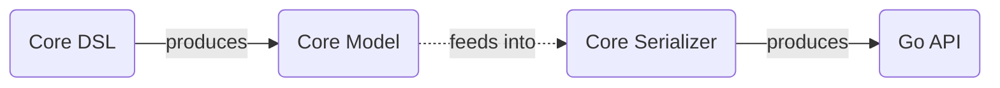
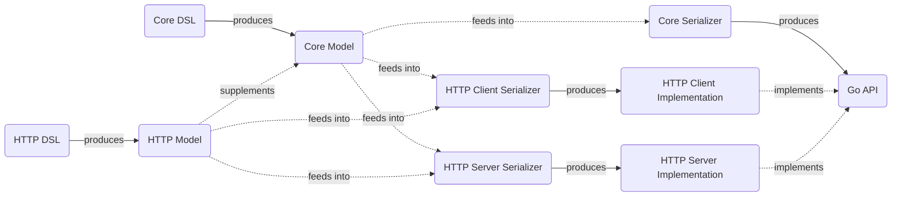

# Go Service Generation Framework

GoServGen is a tool for generating service APIs and transport implementations.

This tool is heavily inspired by [Goa](https://github.com/goadesign/goa) but it makes some fundamental changes which are the cause of this separate open source project instead of a series of issues and pull requests to `Goa`.

* The project aims to use the latest `Go 1.18+` features.
    * It uses generics where applicable.
    * It uses Go modules and relies on projects being module-based.
* The DSL and Go code serializers are designed to be modular. This allows for
  easy 3rd party extensions/plugins and for users to pick only the features
  that they really want to see.
* It aims to generate interfaces and implementations that are as much decoupled
  from this tool's source code as possible, making the generated code
  library-agnostic, at least in theory.
* Instead of generating a temporary `main` package that links against the design
  package, this tool expects that you have a special `main` package for the tool.
    * In reality this is not much different and avoids situations where certain
      dependencies need to be manually and anonymously imported in the project
      for the tool to be able to run.
* It aims to improve the error model.
    * The proposed mechanism is the usage of typed errors and not having a
      custom error type that forces user code to become explicitly aware of
      this package.
    * It uses error wrapping and unwrapping heavily, allowing service
      implementations to return wrapped typed errors and for the transport
      logic to continue to work.
    * It gives control over the error message that is returned by the
      `Error` method of typed errors so that it can be based on a field
      instead of being a hardcoded string.
* And much more.

## Concept

The main things that this tool provides and dictates are the `Core DSL`, `Core Model`, and `Core Serializer`. These represent the API design of your services and the capability to convert them from DSL into actual Go code.

Just being able to generate Go code off of a DSL would be pointless. Here is
where the protocol-specific extensions come into play. For example, we can have
`HTTP DSL`, `HTTP Model`, `HTTP Client Serializer` and `HTTP Server Serializer`
plugins that extend the core model to add the ability to generate Go code that
exposes the service over HTTP or can consume the service through HTTP.

Of course, this could be extended further and we can have plugins for `gRPC` and
others. We can even have plugins that extend each other. For example there may
be an `HTTPv2` plugin that builds on top of the DSL of the `HTTP` plugin.
