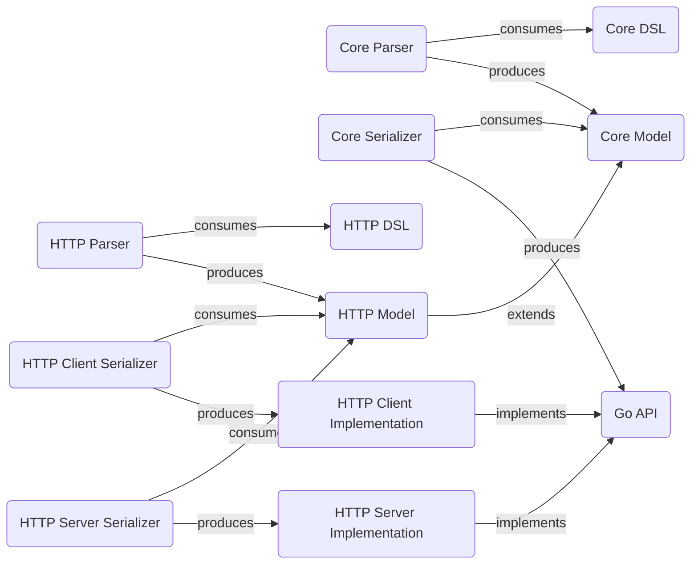

# Go Service Generation Framework

A tool for generating service APIs and transports

## Concept

```mermaid
flowchart LR
    core.dsl(Core DSL)
    core.model(Core Model)
    core.parser(Core Parser)
    core.serializer(Core Serializer)
    core.gocode(Go API)

    http.dsl(HTTP DSL)
    http.model(HTTP Model)
    http.parser(HTTP Parser)
    http.client.serializer(HTTP Client Serializer)
    http.client.gocode(HTTP Client Implementation)
    http.server.serializer(HTTP Server Serializer)
    http.server.gocode(HTTP Server Implementation)

    http.model -- extends --> core.model

    core.parser -- consumes --> core.dsl
    core.parser -- produces --> core.model
    core.serializer -- consumes --> core.model
    core.serializer -- produces --> core.gocode

    http.parser -- consumes --> http.dsl
    http.parser -- produces --> http.model
    http.client.serializer -- consumes --> http.model
    http.client.serializer -- produces --> http.client.gocode
    http.server.serializer -- consumes --> http.model
    http.server.serializer -- produces --> http.server.gocode

    http.client.gocode -- implements --> core.gocode
    http.server.gocode -- implements --> core.gocode
```
